# 🛍️ Flutter E-Commerce App (FakeStore API + Provider)

This project is a simple and clean Flutter e-commerce application built using the FakeStore API for product data and Provider for state management.
The app demonstrates core shopping features and a smooth user experience with well-structured UI screens and business logic

## Tech Stack

Flutter (Dart)

Provider – For state management

http – For REST API calls

FakeStore API – Product data source

## ✨ Features

Home Screen: Fetches and displays products using the http package.

Shop/Product Screen: Product details with “Add to Cart” and “Add to Wishlist” options.

Cart Screen: Shows selected items, quantity updates, item removal, and total price calculation.

Wishlist Screen: Save and manage favorite items.

My Orders Screen: View previously placed orders.

Order Placement Logic: Calculates totals, creates order records, and clears the cart using Provider.
## Screenshots

| | | | |
|---|---|---|---|
| 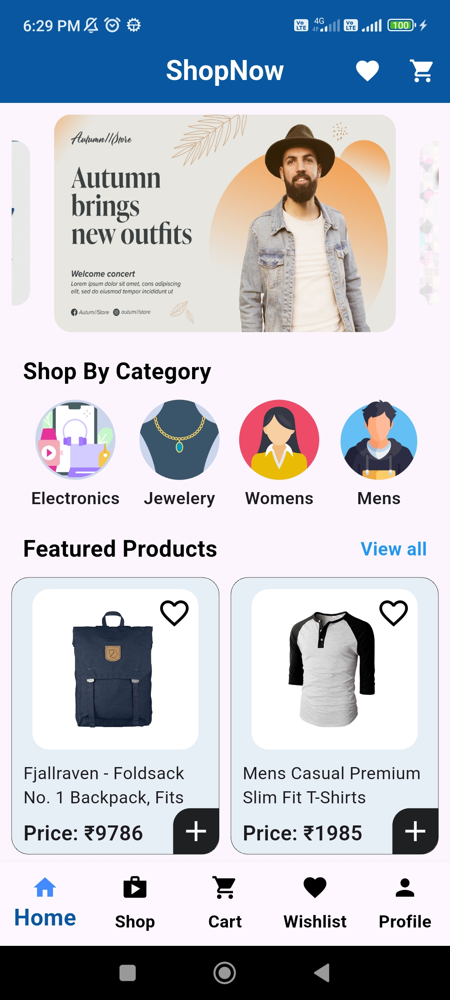 | 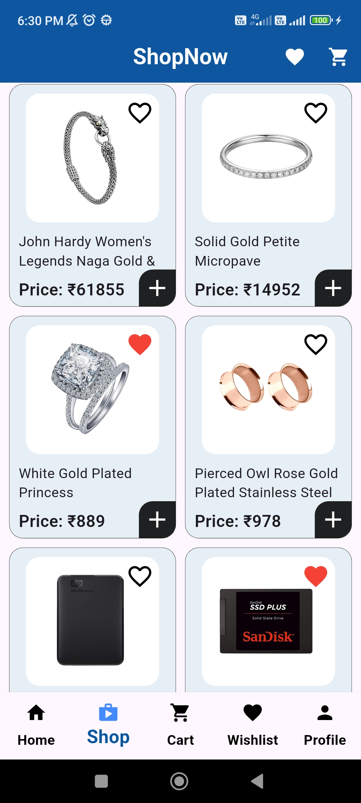 | 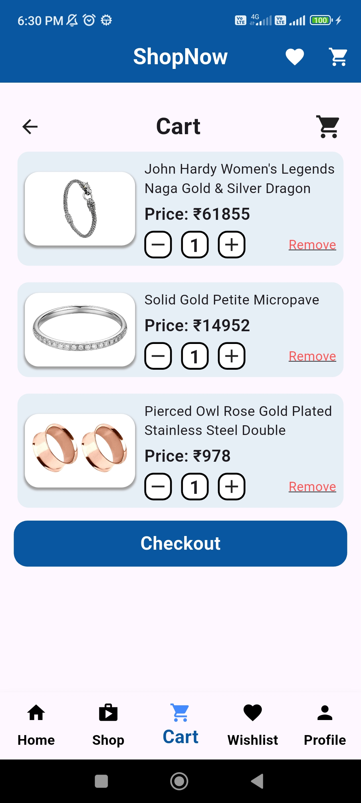 | 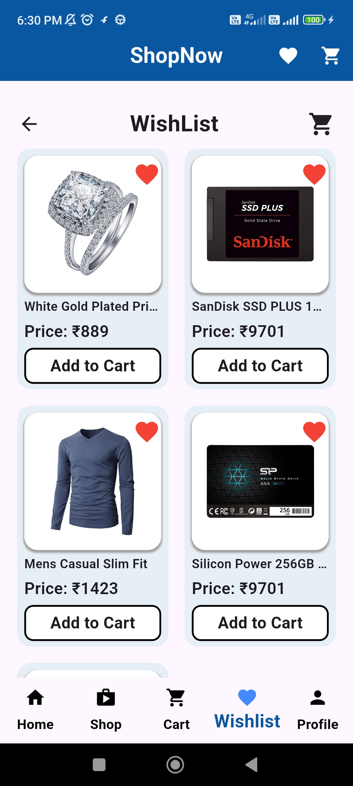 |
| 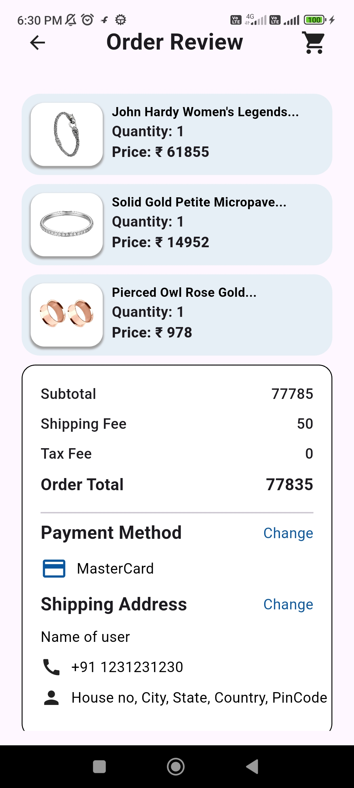 | 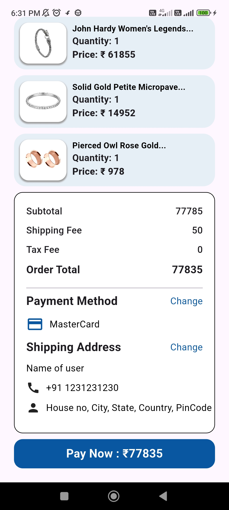 | 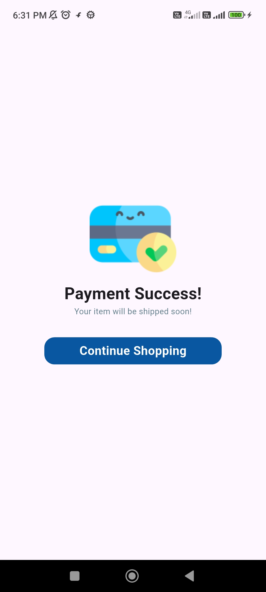 |  |
| 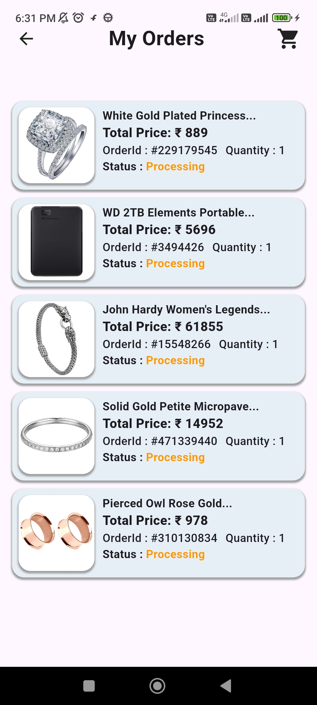 | 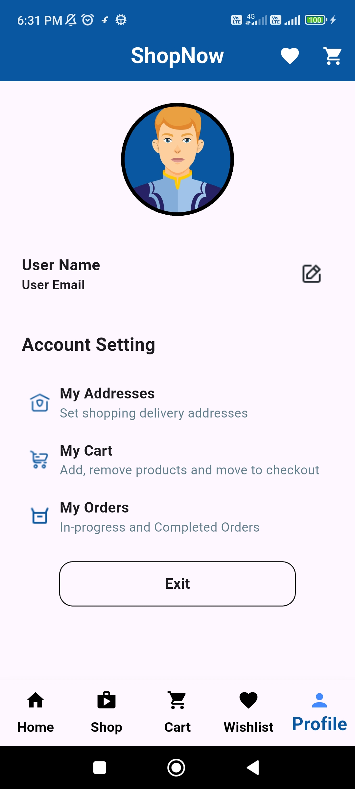 | 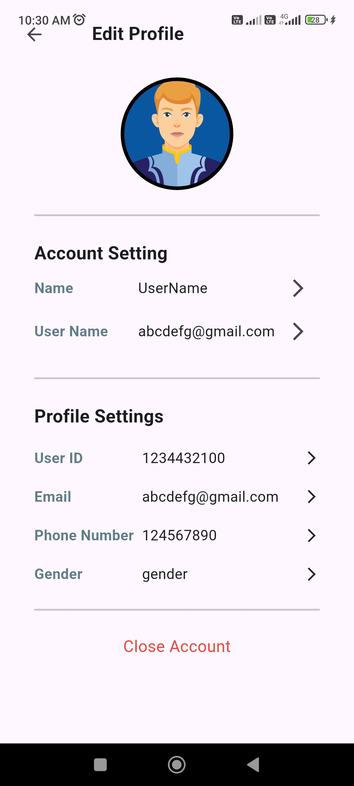 | 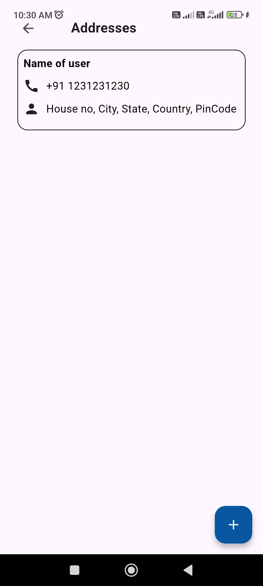 |
| 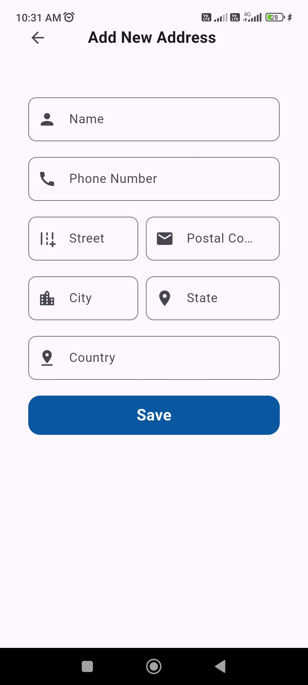 | 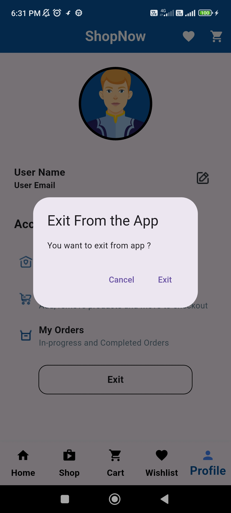 | | |

